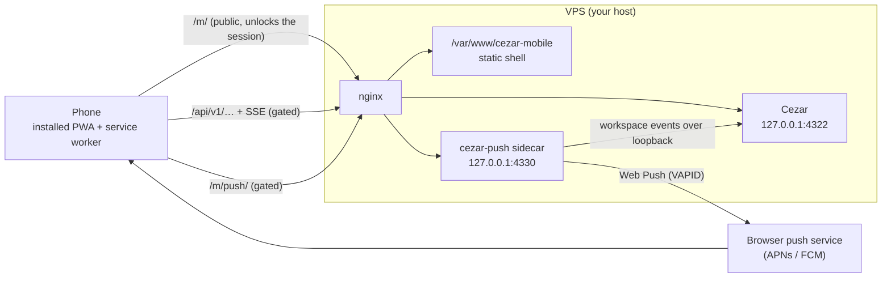
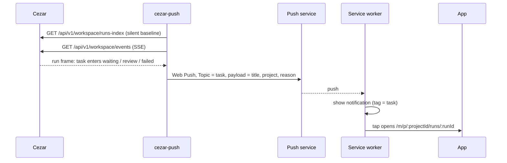
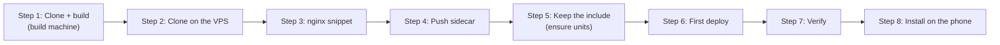

# Cezar Mobile (PWA)

An installable phone client for a
[Cezar](https://github.com/open-mercato/cezar) instance. It answers one question
in three seconds: **what are the agents doing, and is anything waiting for me?**
Then it lets you act on the answer, and it can send you a push notification
when a task starts waiting for you.

The app is served from the same origin as Cezar, under `/m/`. That is not a
preference: Cezar rejects cross-origin writes with 403 and ships no CORS, so
no other arrangement works. You install it on the server that already runs
Cezar, next to it. The app reads its origin from the page, so one build runs on
any host. The reference deployment is `https://cezar.ciey.studio`. Everywhere
below, replace `<your-host>` with your own host.

## Contents

- [Architecture](#architecture)
- [Prerequisites](#prerequisites)
- [Configuration reference](#configuration-reference)
- [Installation](#installation)
- [Install on the phone](#install-on-the-phone)
- [Updating and rotating the access key](#updating-and-rotating-the-access-key)
- [Troubleshooting](#troubleshooting)
- [Local development](#local-development)
- [License](#license)

## Architecture



There are three parts:

- **The shell**: static files in `/var/www/cezar-mobile`, served by nginx at
  `/m/`. It sits outside Cezar's cookie gate, so the app can load and explain
  itself before it has a session.
- **Cezar's own API**: `/api/v1/…` and its event streams, behind the gate. The
  app talks to it directly, on the same origin.
- **cezar-push**: a small sidecar that watches Cezar and sends Web Push. nginx
  serves it at `/m/push/`, also behind the gate.

The service worker caches only the shell. It never touches `/api/**` or the
streams.

When a task starts needing you, this happens:



The sidecar pushes on the *transition* into a state that needs you. Each
reconnect re-seeds a silent baseline, so work that was already waiting never
rings twice. No code and no transcript content leave the server.

Installation goes in this order:



## Prerequisites

**On the machine you build and deploy from** (your laptop, or GitHub Actions):

- [ ] Node.js 24 and npm (the repo is an npm workspaces monorepo; CI uses Node 24)
- [ ] git
- [ ] rsync (GNU rsync 3.x or macOS openrsync)
- [ ] SSH access to the VPS as the user who will own `/var/www/cezar-mobile`

**On the VPS:**

- [ ] A running Cezar instance, installed with `cezar server-install`, listening
      on `127.0.0.1:4322`, and reachable at `https://<your-host>/`
- [ ] Cezar's nginx access gate in place. The installers depend on two parts of it:
  - the `$cezar_gate_ok` map at http level (`/etc/nginx/conf.d/cezar-gate.conf`)
  - the `if ($arg_key = …)` unlock guard inside the vhost's `location /`, which
    is what makes the `https://<your-host>/?key=…` access link work
- [ ] The vhost served over `listen 443 ssl http2;`. HTTP/1.1 limits a host to
      six connections, which starves the event streams.
- [ ] Root through `sudo`, for nginx and the system units
- [ ] Node.js 24 at `/usr/bin/node` (the sidecar unit runs that path), npm, git
      and curl, for the user Cezar runs as
- [ ] systemd, with user services (`systemctl --user`) and lingering allowed
- [ ] rsync. For the CI deploy key you also need `rrsync`, at `/usr/bin/rrsync`,
      which ships with rsync 3.2.4 or newer on Debian and Ubuntu.

## Configuration reference

Configuration lives in four places. Nothing here is a secret, except the cookie
in `.env.local` and the GitHub secrets.

### `.env.local` (repo root, on the build machine)

Gitignored. Never commit it. `scripts/deploy.sh` and the Vite dev server read it.

| Name | Required | Default | Example | What it does |
| --- | --- | --- | --- | --- |
| `DEPLOY_HOST` | for `npm run deploy` | none | `ubuntu@<your-host>` | SSH target the shell is rsynced to |
| `DEPLOY_PATH` | no | `/var/www/cezar-mobile` | `/var/www/cezar-mobile` | Target directory on the VPS. Leave it unset unless you changed the snippet's `alias`. |
| `PUBLIC_URL` | no | none | `https://<your-host>/m/` | Only printed at the end of a deploy |
| `DEPLOY_DRY_RUN` | no | unset | `1` | Build, connect and diff, but write nothing. Usually passed on the command line. |
| `CEZAR_URL` | no (dev only) | `http://127.0.0.1:4321` (the local mock) | `https://<your-host>` | Where `npm run dev` proxies `/api` |
| `CEZAR_COOKIE` | no (dev only) | none | `cezar_access=…` | Session cookie the dev proxy sends to a gated Cezar |

### `~/.cezar-push/env` (on the VPS, user Cezar runs as)

Mode 600, written by `deploy/push/install.sh`. systemd reads it on top of the
defaults in `deploy/systemd/cezar-push.service`. The sidecar reads its settings
in `apps/push-sidecar/src/config.ts`.

| Name | Required | Default | Example | What it does |
| --- | --- | --- | --- | --- |
| `PUBLIC_ORIGIN` | **yes** | none (the sidecar will not start) | `https://<your-host>` | The only origin allowed to subscribe. It must be a bare origin (`https://host[:port]`) with no trailing slash. |
| `PORT` | no | `4330` | `4331` | Sidecar port. If you change it, change `proxy_pass` in the nginx snippet to match. |
| `CEZAR_URL` | no | `http://127.0.0.1:4322` | `http://127.0.0.1:4322` | Cezar on loopback, where it answers without the gate's cookie |
| `VAPID_SUBJECT` | no | `PUBLIC_ORIGIN` | `mailto:ops@example.com` | Contact the push services may use. Must start with `mailto:` or `https://`. |
| `HOST` | no | `127.0.0.1` | `127.0.0.1` | Leave it on loopback. nginx is the only way in. |

Two more variables are read by `deploy/push/install.sh` itself. Pass them on its
command line, not in the file (the file lives inside `STATE_DIR`):

| Name | Required | Default | What it does |
| --- | --- | --- | --- |
| `CEZAR_PUSH_HOME` | no | `~/cezar-push` | Where the one-file bundle is installed |
| `STATE_DIR` | no | `~/.cezar-push` | VAPID keys, subscriptions and the env file above |

### GitHub repository secrets and variables (CI deploy)

Only needed if you let `.github/workflows/deploy.yml` deploy on every merge to
`main`. Until all three secrets exist, the job stays green and posts a warning
instead of shipping. If only some of them exist, it fails.

| Name | Kind | Required | Example |
| --- | --- | --- | --- |
| `DEPLOY_HOST` | secret | yes | `ubuntu@<your-host>` |
| `DEPLOY_SSH_KEY` | secret | yes | Private half of a dedicated, passphrase-less ed25519 key |
| `DEPLOY_KNOWN_HOSTS` | secret | yes | Output of `ssh-keyscan <your-host>`. The host key is pinned. |
| `DEPLOY_PATH` | variable | yes, with the `rrsync` key below | `/cezar-mobile` |
| `PUBLIC_URL` | variable | no | `https://<your-host>/m/` (the link on the run page) |

`DEPLOY_PATH` is `/cezar-mobile` in CI, not `/var/www/cezar-mobile`. `rrsync`
resolves every path inside `/var/www`, so the absolute path would land in
`/var/www/var/www/cezar-mobile`. Don't copy the CI value into `.env.local`.

### The nginx vhost

The path of the vhost file Cezar's installer manages, e.g.
`/etc/nginx/sites-available/<your-vhost>`. You pass it to
`deploy/nginx/install.sh` and write it into the ensure units in step 5.

## Installation

Each step ends with a **Check** line. Don't move on until it passes.

### 1. Clone and build (build machine)

```bash
git clone https://github.com/cieyhomelab/cezar-pwa.git
cd cezar-pwa
npm ci
npm run build
```

**Check:** `ls apps/pwa/dist/index.html apps/push-sidecar/dist/cezar-push.mjs`
lists both files.

### 2. Clone on the VPS

The nginx and sidecar installers run from a checkout on the VPS. Clone it as the
user Cezar runs as:

```bash
git clone https://github.com/cieyhomelab/cezar-pwa.git ~/cezar-pwa
cd ~/cezar-pwa
npm ci
```

Also create the directory the shell will be deployed to, owned by the user you
deploy as:

```bash
sudo install -d -o "$USER" -g "$USER" -m 755 /var/www/cezar-mobile
```

**Check:** `node --version` prints `v24.x`, and `ls -ld /var/www/cezar-mobile`
shows your user as the owner.

### 3. Wire up nginx (VPS, root)

```bash
sudo deploy/nginx/install.sh /etc/nginx/sites-available/<your-vhost>
```

This adds one `include` to the vhost for `/m/` and `/m/push/`. It backs up
every file it touches, and reloads nginx only if `nginx -t` passes. If the
config fails the test, it rolls back. It prints its own rollback command. It
also copies the vhost's `?key=` unlock guard into
`/etc/nginx/snippets/cezar-mobile-unlock.conf` (mode 600, never printed).
Without that copy, the installed app cannot unlock itself. If the vhost has more
than one `location /` block, the installer stops and asks you to add the
`include` by hand.

**Check:** the output has no `warning:` lines, and
`sudo nginx -T 2>/dev/null | grep -c 'cezar-mobile'` prints a number greater
than 0. `/m/` has nothing to serve until the first deploy in step 6.

### 4. Install the push sidecar (VPS, user Cezar runs as, not root)

```bash
PUBLIC_ORIGIN=https://<your-host> deploy/push/install.sh
sudo loginctl enable-linger "$USER"
```

The installer builds the bundle into `~/cezar-push`, creates the VAPID key pair
once in `~/.cezar-push`, writes `PUBLIC_ORIGIN` to `~/.cezar-push/env`, then
installs and starts the `cezar-push` user unit on `127.0.0.1:4330`. Lingering
keeps the unit running after you log out. If you run the installer on a
terminal without `PUBLIC_ORIGIN`, it asks for it. After the first run it reads
the value from the env file. More detail on the sidecar is in
[`apps/push-sidecar/README.md`](apps/push-sidecar/README.md).

**Check:** the installer ends with `==> healthy on 127.0.0.1:4330: …`, and
`systemctl --user is-active cezar-push` prints `active`.

### 5. Keep `/m/` working across `cezar server-install` (VPS, root, once)

When Cezar's installer rewrites the vhost, it drops the `include`, and `/m/`
falls behind the gate. Two system units put the include back: a path unit that
fires when the vhost changes, and a timer that checks every 10 minutes. The
units in the repo name the reference deployment's vhost. The `sed` below swaps
in yours:

```bash
sudo install -o root -g root -m 755 deploy/nginx/install.sh /usr/local/sbin/cezar-mobile-nginx-ensure
vhost=/etc/nginx/sites-available/<your-vhost>
for u in path service timer; do
  sed "s|/etc/nginx/sites-available/cezar-cezar-ciey-studio|$vhost|g" deploy/systemd/cezar-mobile-nginx-ensure.$u |
    sudo tee /etc/systemd/system/cezar-mobile-nginx-ensure.$u >/dev/null
done
sudo systemctl daemon-reload
sudo systemctl enable --now cezar-mobile-nginx-ensure.path cezar-mobile-nginx-ensure.timer
```

Root runs its own copy of the script from `/usr/local/sbin`, never the
checkout, so an unprivileged user can't change what root runs.

**Check:** `systemctl is-active cezar-mobile-nginx-ensure.path cezar-mobile-nginx-ensure.timer`
prints `active` twice. To test it, delete the `include` line from the vhost and
wait a few seconds. `journalctl -u cezar-mobile-nginx-ensure` then reports that
it put the line back.

### 6. First deploy

Pick one of the two ways. Both run the same `scripts/deploy.sh`. The deploy
syncs in two passes, so a phone never loads a half-updated app.

**From your machine.** Put `DEPLOY_HOST=user@<your-host>` in `.env.local`, then
try a dry run first. It builds, connects and diffs, and writes nothing:

```bash
DEPLOY_DRY_RUN=1 npm run deploy
npm run deploy
```

**From GitHub Actions**, on every merge to `main`. Create a deploy key on the
VPS that can only write files:

```bash
ssh-keygen -t ed25519 -N '' -f ~/.ssh/cezar_pwa_deploy
echo "command=\"/usr/bin/rrsync -wo /var/www\",restrict $(cat ~/.ssh/cezar_pwa_deploy.pub)" >> ~/.ssh/authorized_keys
```

The forced `rrsync` command means a leaked key can write under `/var/www` and
do nothing else: no shell, no reading files back, no access to Cezar. Then, from
a machine with the `gh` CLI, set the secrets and variables from the
[configuration reference](#github-repository-secrets-and-variables-ci-deploy):

```bash
gh secret set DEPLOY_HOST --body 'user@<your-host>'
gh secret set DEPLOY_SSH_KEY < cezar_pwa_deploy          # the private half, copied off the VPS
ssh-keyscan <your-host> | gh secret set DEPLOY_KNOWN_HOSTS
gh variable set DEPLOY_PATH --body '/cezar-mobile'
gh variable set PUBLIC_URL --body 'https://<your-host>/m/'
```

Delete the local copy of the private key once it is stored. Then run the
**Deploy** workflow from the Actions tab with **dry run** checked, and without
it once the dry run passes.

**Check:** the deploy ends with `==> done. Shell is live …`, and
`curl -s -o /dev/null -w '%{http_code}\n' https://<your-host>/m/` prints `200`,
even without a cookie.

### 7. Verify the whole path (VPS)

```bash
PUBLIC_ORIGIN=https://<your-host>
systemctl --user is-active cezar-push                                                # active
curl -s -o /dev/null -w '%{http_code}\n' "$PUBLIC_ORIGIN/m/push/vapid-public-key"    # 403: gated. Never index.html
curl -s -o /dev/null -w '%{http_code}\n' -X POST "$PUBLIC_ORIGIN/m/session/end"      # 403: no same-origin Origin header
```

**Check:** the output is `active`, `403`, `403`. If `vapid-public-key` returns
`200` with HTML, see [Troubleshooting](#troubleshooting).

## Install on the phone

You need the access link for your Cezar instance, `https://<your-host>/?key=…`.
It is the same link you use to open the cockpit.

1. **Open the app.** In Safari (iPhone) or Chrome (Android), go to
   `https://<your-host>/m/`.
2. **Add it to the home screen.**
   - iPhone: tap **Share**, then **Add to Home Screen**.
   - Android: open the Chrome menu, then **Add to Home screen** or
     **Install app**.
3. **Open Cezar from the home screen icon.** The installed app keeps its own
   cookies, separate from the browser, so it asks you to connect even if you
   are already signed in to the cockpit in Safari.
4. **Connect.** On the "Connect to Cezar" screen, paste the whole access link,
   including the `key` at the end, and tap **Connect**. The link is not stored
   on the phone.
5. **Turn on notifications.** Go to **Settings → Notifications**, tap
   **Turn on notifications**, and allow them when asked. Then tap
   **Send a test notification**. On an iPhone, this works only in the app opened
   from the home screen icon, on iOS 16.4 or newer.

## Updating and rotating the access key

- **App update.** Merge to `main` (CI deploys), or run `npm run deploy` from an
  up-to-date checkout. Installed apps offer **Refresh** on their next launch.
- **Sidecar update.** On the VPS: `cd ~/cezar-pwa && git pull && npm ci && deploy/push/install.sh`.
  It keeps the VAPID keys and the subscriptions, so phones stay subscribed.
- **nginx snippet update.** If a pull changed anything under `deploy/nginx/`,
  re-run `sudo deploy/nginx/install.sh /etc/nginx/sites-available/<your-vhost>`.
  If `install.sh` itself changed, also re-run the `sudo install … /usr/local/sbin/cezar-mobile-nginx-ensure`
  line from step 5.
- **Rotating the access key.** After you change the key in Cezar's gate,
  re-run `sudo deploy/nginx/install.sh /etc/nginx/sites-available/<your-vhost>`.
  `/m/` has its own copy of the unlock guard, and it keeps accepting the old key
  until you do. From then on, any phone that connects needs the new link.

## Troubleshooting

**`/m/push/vapid-public-key` returns `200` and the app's HTML.** nginx is not
routing `/m/push/`, so the request falls through to the shell's `index.html`.
The vhost has an old snippet, or no snippet at all. Re-run
`sudo deploy/nginx/install.sh <vhost>` from an up-to-date checkout. To confirm,
run `sudo nginx -T | grep -n 'location ^~ /m/push/'`.

**`/m/` asks for a cookie, or redirects, after `cezar server-install`.** The
installer rewrote the vhost and dropped the `include`. The ensure units from
step 5 fix this within seconds. If they are not installed, install them. To fix
it by hand now, run
`sudo systemctl start cezar-mobile-nginx-ensure.service`, or re-run step 3.
Failures show in `systemctl --failed` and `journalctl -u cezar-mobile-nginx-ensure`.

**The app says the gateway did not accept the link, or that the server does not
handle unlocking.** First check that you pasted the whole link, including
`?key=…`. If the link is complete, the unlock guard was not copied to `/m/`.
`sudo test -s /etc/nginx/snippets/cezar-mobile-unlock.conf && echo present`
prints nothing in that case. The installer copies the guard only if it finds
exactly one `if ($arg_key = …)` block in the vhost, and it warns you when it
doesn't. Fix the vhost, then re-run step 3.

**The app says the notification server is not responding.** `/m/push/` returns
`502` because the sidecar is down. Look at
`journalctl --user -u cezar-push -n 50`. The most common cause is a missing or
malformed `PUBLIC_ORIGIN` in `~/.cezar-push/env`.

**`nginx -t` fails with `unknown "cezar_gate_ok" variable`, and the installer
rolls back.** The host has no Cezar access gate. The snippet requires it, so
`/m/push/` is never published without the gate in front of it. Install the gate
with Cezar's own installer first.

**No notification option on the iPhone.** Open the app from the home screen
icon, not from Safari, and check that the phone runs iOS 16.4 or newer. If you
blocked notifications earlier, turn them back on in iOS
**Settings → Notifications → Cezar**.

## Local development

```bash
npm ci
npm run dev          # the PWA on http://localhost:5173/m/, proxying /api
npm run typecheck
npm test             # vitest across pwa, sidecar and shared
npm run lint         # oxlint
npm run test:e2e     # Playwright on WebKit, against a production build
```

`npm run dev` proxies `/api` to `CEZAR_URL` from `.env.local`. To work against a
live instance, set `CEZAR_URL=https://<your-host>` and `CEZAR_COOKIE`. The proxy
also rewrites `Origin`, so Cezar's same-origin guard accepts the writes. Without
`CEZAR_URL`, the proxy goes to a local mock on `http://127.0.0.1:4321`. Start it
with `CEZ_DRY_RUN=1 npx cezar-cli`.

`npm run test:e2e` needs WebKit once: `npx playwright install webkit`. The suite
never talks to a live Cezar.

```
apps/pwa/                 # the PWA
apps/push-sidecar/        # cezar-push, the Web Push sidecar
packages/shared/          # attention rule + types shared by app and sidecar
packages/cezar-contract/  # Cezar's contract, vendored and pinned
deploy/                   # nginx snippet and installer, sidecar installer, systemd units
scripts/                  # deploy, contract sync, icon generation
```

Before you change anything, read [`CLAUDE.md`](CLAUDE.md) for the project rules
and [`docs/CEZAR_API.md`](docs/CEZAR_API.md) for the API the app talks to.

## License

[MIT](LICENSE). `packages/cezar-contract/` is vendored from
[Cezar](https://github.com/open-mercato/cezar) and keeps its own MIT notice in
[`packages/cezar-contract/LICENSE`](packages/cezar-contract/LICENSE).
