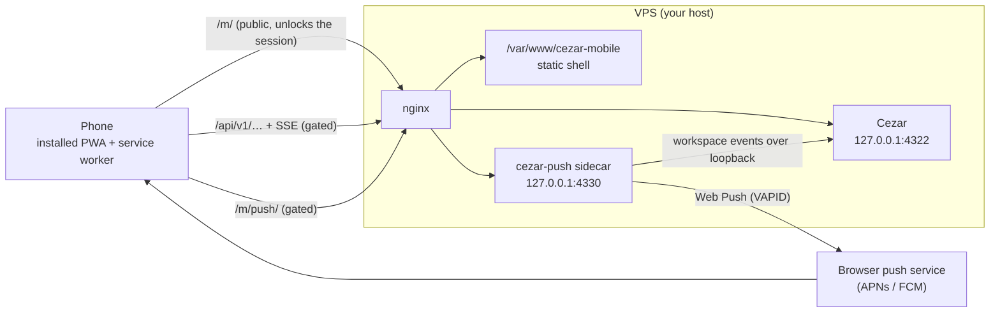
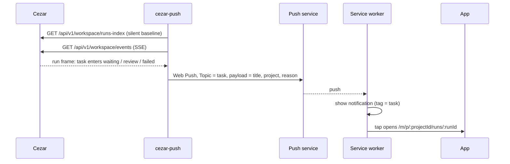
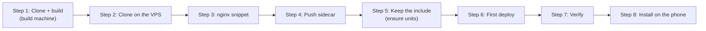

# Cezar Mobile (PWA)

An installable phone client for a
[Cezar](https://github.com/open-mercato/cezar) instance. It answers one question
in three seconds: **what are the agents doing, and is anything waiting for me?**
It lets you act on the answer, and sends a push notification when a task starts
waiting for you.

The app is served from the same origin as Cezar, under `/m/`. This is required:
Cezar rejects cross-origin writes with 403 and ships no CORS. One build runs on
any host. Replace `<your-host>` and `<your-vhost>` below with your own values.
Full reference (prerequisites, every setting, per-step checks, updating,
troubleshooting): [`docs/DEPLOYMENT.md`](docs/DEPLOYMENT.md).

## Architecture



- **Shell**: static files served by nginx at `/m/`, outside Cezar's cookie
  gate, so the app can load and explain itself before it has a session. The
  service worker caches only the shell, never `/api/**` or the streams.
- **Cezar API**: `/api/v1/…` and its event streams, behind the gate.
- **cezar-push**: a sidecar that watches Cezar and sends Web Push, served at
  `/m/push/` behind the gate.

When a task starts needing you:



The sidecar pushes only on the transition into a state that needs you; work
already waiting never rings twice. No code or transcript content leaves the
server.

## Installation

Requires a running Cezar installed with `cezar server-install` (with its nginx
access gate), Node.js 24, and systemd user services on the VPS. See
[prerequisites](docs/DEPLOYMENT.md#prerequisites).



```bash
# 1. Build machine: clone and build
git clone https://github.com/cieyhomelab/cezar-pwa.git && cd cezar-pwa
npm ci && npm run build

# 2. VPS, as the user Cezar runs as: clone and create the deploy target
git clone https://github.com/cieyhomelab/cezar-pwa.git ~/cezar-pwa && cd ~/cezar-pwa
npm ci
sudo install -d -o "$USER" -g "$USER" -m 755 /var/www/cezar-mobile

# 3. VPS: add the /m/ and /m/push/ include to the vhost (backs up, tests, reloads)
sudo deploy/nginx/install.sh /etc/nginx/sites-available/<your-vhost>

# 4. VPS, not root: install and start the cezar-push user unit
PUBLIC_ORIGIN=https://<your-host> deploy/push/install.sh
sudo loginctl enable-linger "$USER"

# 5. VPS: restore the include whenever `cezar server-install` rewrites the vhost
sudo install -o root -g root -m 755 deploy/nginx/install.sh /usr/local/sbin/cezar-mobile-nginx-ensure
vhost=/etc/nginx/sites-available/<your-vhost>
for u in path service timer; do
  sed "s|/etc/nginx/sites-available/cezar-cezar-ciey-studio|$vhost|g" deploy/systemd/cezar-mobile-nginx-ensure.$u |
    sudo tee /etc/systemd/system/cezar-mobile-nginx-ensure.$u >/dev/null
done
sudo systemctl daemon-reload
sudo systemctl enable --now cezar-mobile-nginx-ensure.path cezar-mobile-nginx-ensure.timer

# 6. Build machine: set DEPLOY_HOST=user@<your-host> in .env.local, then
DEPLOY_DRY_RUN=1 npm run deploy   # builds, connects and diffs; writes nothing
npm run deploy

# 7. VPS: verify — expect active, 403, 403
systemctl --user is-active cezar-push
curl -s -o /dev/null -w '%{http_code}\n' https://<your-host>/m/push/vapid-public-key
curl -s -o /dev/null -w '%{http_code}\n' -X POST https://<your-host>/m/session/end
```

To deploy from GitHub Actions on every merge to `main` instead of step 6, see
[first deploy](docs/DEPLOYMENT.md#6-first-deploy).

## Install on the phone

You need the Cezar access link, `https://<your-host>/?key=…` (the same link
that opens the cockpit).

1. Open `https://<your-host>/m/` in Safari (iPhone) or Chrome (Android).
2. Add it to the home screen: iPhone **Share → Add to Home Screen**; Android
   Chrome menu **→ Install app** (or **Add to Home screen**).
3. Open Cezar from the home screen icon. The installed app has its own cookies,
   so it asks you to connect even if Safari is signed in.
4. On **Connect to Cezar**, paste the whole access link, including `?key=…`,
   and tap **Connect**. The link is not stored on the phone.
5. **Settings → Notifications → Turn on notifications**, allow, then
   **Send a test notification**. On iPhone this requires the home screen app on
   iOS 16.4 or newer.

## Local development

```bash
npm ci
npm run dev          # http://localhost:5173/m/, proxying /api to CEZAR_URL
npm run typecheck
npm run lint         # oxlint
npm test             # vitest across pwa, sidecar and shared
npm run test:e2e     # Playwright on WebKit (once: npx playwright install webkit)
```

Without `CEZAR_URL` in `.env.local`, the dev proxy targets a local mock on
`http://127.0.0.1:4321`; start it with `CEZ_DRY_RUN=1 npx cezar-cli`. For a live
instance set `CEZAR_URL=https://<your-host>` and `CEZAR_COOKIE`.

```
apps/pwa/                 # the PWA
apps/push-sidecar/        # cezar-push, the Web Push sidecar
packages/shared/          # attention rule + types shared by app and sidecar
packages/cezar-contract/  # Cezar's contract, vendored and pinned
deploy/                   # nginx snippet and installer, sidecar installer, systemd units
scripts/                  # deploy, contract sync, icon generation
```

Before changing code, read [`CLAUDE.md`](CLAUDE.md) and
[`docs/CEZAR_API.md`](docs/CEZAR_API.md).

## License

[MIT](LICENSE). `packages/cezar-contract/` is vendored from
[Cezar](https://github.com/open-mercato/cezar) and keeps its own MIT notice in
[`packages/cezar-contract/LICENSE`](packages/cezar-contract/LICENSE).
